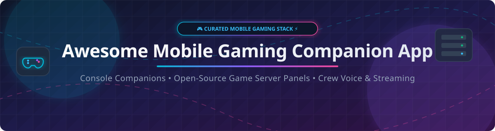

  

# 🎮 Awesome Mobile Gaming Companion App 📱⚡

  
  
  
  
  

> **Curated List of Commercial SaaS Companion Apps & Open-Source Mobile Gaming Projects** 🚀  
> *Discover high-performance Console Companion Apps, Game Server Control Panels, Controller Mapping Utilities, Game Streaming Tools, and Gaming Crew Voice/Chat Solutions.*

📅 **Last updated: October 2026**

---

## 🌟 Overview & Market Context 📌

This repository curates notable **commercial SaaS companion platforms** and **open-source GitHub projects** designed for **Mobile Gaming Companions & Game Management Infrastructure**. These tools empower gamers, server administrators, and crews to remotely manage consoles, pair Bluetooth/USB gamepads, profile mobile FPS/RAM performance, deploy private dedicated game servers, and stream low-latency audio/video.

Popular first-party and commercial companion solutions include **Xbox Mobile App**, **PlayStation App**, **Nintendo Switch Online App**, **Steam Mobile App**, **Razer Nexus**, **Backbone App**, and **GameBench**.

The open-source mobile gaming companion ecosystem is **exceptionally vibrant and community-driven** 🔥:
- 🎮 **Game Streaming & Remote Play**: **Sunshine** & **Moonlight** provide ultra-low-latency game streaming to mobile devices.
- 🛠️ **Game Server Panels**: **Pterodactyl Panel**, **Pelican Panel**, and **GameAP** deliver containerized game server deployment.
- 🎙️ **Crew Voice & Presence**: **m3llo**, **Squawk**, and **Fresence** offer self-hosted, private crew chat and stream sharing.

---

## 📖 Table of Contents 📑

- [☁️ SaaS / Hosted Platforms](#%EF%B8%8F-saas--hosted-platforms)
- [🔓 Open-Source GitHub Projects](#-open-source-github-projects)
- [🤝 How to Contribute](#-how-to-contribute)
- [💖 Support & Sponsorship](#-support--sponsorship)
- [📈 Star History](#-star-history)
- [⚠️ Disclaimer](#%EF%B8%8F-disclaimer)

---

## ☁️ SaaS / Hosted Platforms 🌐

> **📊 Market Context & Fragmentation**: The global mobile gaming companion app and game management software market is estimated at **~$2.5B in 2026** and projected to reach **~$5.8B by 2032**. The sector is **moderately fragmented** — first-party ecosystem apps (Microsoft Xbox, Sony PlayStation, Nintendo Switch) lead in total active user volumes, while specialized hardware vendors (Razer, Backbone) and enterprise performance profilers (GameBench) serve controller utilities and QA niches. There is **no single winner-take-all monopoly**.

| Platform | Description | Pricing (Starting Tier) | Free Tier Limits | Company Size |
|----------|-------------|------------------------|------------------|--------------|
| **[Xbox Mobile App](https://www.xbox.com/)** 🟢 | **Microsoft's console companion.** Game Pass management, remote installs, party chat, achievements, and Xbox Remote Play. | **Free** ($0/mo) | **Unlimited** core companion & Remote Play features with free Xbox account | **~$281B revenue (Microsoft FY2025)** |
| **[PlayStation App](https://www.playstation.com/)** 💙 | **Sony's console companion.** Trophy tracking, PS Store shopping, Remote Play launching, and PSN friend activity. | **Free** ($0/mo) | **Unlimited** core companion & party features with free PSN account | **~$30B gaming revenue (Sony FY2025 est.)** |
| **[Nintendo Switch App](https://www.nintendo.com/)** 🔴 | **Nintendo's companion.** Friend status, QR code sharing, voice chat, and game-specific services (Splatoon, Smash Bros). | **Free** ($0/mo) | **Unlimited** core companion features with free Nintendo account | **~$12B revenue (Nintendo FY2025 est.)** |
| **[Steam Mobile App](https://store.steampowered.com/)** 💨 | **Valve's companion.** Steam Guard 2FA authenticator, remote game downloads, store browsing, and Steam Community chat. | **Free** ($0/mo) | **Unlimited** Steam Guard, store, and chat features with free Steam account | **~$6.5B revenue (Valve est.)** |
| **[Razer Nexus](https://www.razer.com/)** 🐍 | **Controller companion for Razer Kishi/Prio.** Firmware updates, button remapping, and Virtual Controller touch mode. | **Free** ($0/mo) | **Unlimited** remapping, firmware updates, and launcher features | **~$1.5B revenue (Razer FY2025 est.)** |
| **[Backbone App](https://backbone.com/)** 🕹️ | **All-in-one game launcher & clip manager.** Indexes Android games, cloud services, screen record, and party chat. | **$39.99/year** ($3.33/mo) for Backbone+ | **Free tier**: Unlimited library launcher & firmware updates. **Backbone+**: 30-day free trial included | **Private (~$100M+ raised / valuation)** |
| **[GameBench](https://www.gamebench.net/)** 📊 | **Mobile game performance profiling.** Real-time FPS monitoring, battery power draw, RAM usage, and stability testing. | **Custom Enterprise Quote** (contact sales) | **28-day free trial** with 30 mins of GameBench Pro testing & unlimited dashboard access | **Private (Bootstrapped / Venture)** |

---

## 🔓 Open-Source GitHub Projects ⚡

*Sorted in descending order by GitHub Star count.* 🌟

| Repo | Description | Stars |
|------|-------------|-------|
| **[Sunshine](https://github.com/LizardByte/Sunshine)** ☀️ | **Self-hosted low-latency game stream host.** Open-source Moonlight server supporting desktop and mobile streaming with low latency, hardware encoding (NVIDIA NVENC, AMD AMF, Intel QuickSync). |  |
| **[Playnite](https://github.com/JosefNemec/Playnite)** 🎮 | **Open-source video game library manager.** Unifies Steam, Epic, GOG, Origin, Ubisoft, and emulator libraries with mobile remote control & metadata scraper extensions. |  |
| **[Pterodactyl Panel](https://github.com/pterodactyl/panel)** 🦖 | **Production-grade game server management panel.** Built with PHP/Laravel and React. Deploys game servers in isolated Docker containers via Wings runner. |  |
| **[Moonlight Android](https://github.com/moonlight-stream/moonlight-android)** 🌙 | **Open-source NVIDIA GameStream / Sunshine client for Android.** Stream PC games directly to Android phones, tablets, and handheld consoles at 120 FPS with HDR support. |  |
| **[Pelican Panel](https://github.com/parkervcp/panel)** 🦤 | **Modern, open-source game server control panel.** Lightweight Pterodactyl alternative featuring native web panel UI, Docker container management, and single-binary Wings daemon. |  |
| **[GameAP](https://github.com/gameap/gameap)** ⚡ | **High-performance game server management panel.** Go-based Pterodactyl alternative with built-in ACME SSL, Docker support, and multi-node S3 deployments. |  |
| **[OpenKruiseGame (OKG)](https://github.com/openkruise/kruise-game)** ☸️ | **CNCF Kubernetes workload for game servers.** Multicloud cloud-native game server orchestration with hot updates, fixed IP/port routing, and auto-scaling. |  |
| **[m3llo](https://github.com/mollohq/mello)** 🎙️ | **Self-hostable voice, text & streaming app for gaming crews.** Built in Rust (Apache 2.0). Low-latency voice with noise cancellation, 1080p60 streaming, and session history feed. |  |
| **[GameServerManager (GSM)](https://github.com/GSManagerXZ/GameServerManager)** 🕹️ | **One-click game server deployment panel.** React + TypeScript + Node.js architecture supporting 40+ Steam games (Palworld, Rust, Valheim, Project Zomboid) with web Xterm.js terminal. |  |
| **[Squawk](https://github.com/shynsec/squawk)** 🦜 | **Private, self-hosted voice & text chat for gaming groups.** Tailscale VPN-only WebRTC audio, zero-trackers, always-on channels, and mobile-responsive layout. |  |
| **[Fresence](https://github.com/Berupor/Fresence)** 📡 | **End-to-end encrypted friend presence widget.** Discord-style activity cards displaying current playing game, media track, and status across mobile and desktop. |  |
| **[Cobalt](https://github.com/artorias-developer/cobalt)** 🛡️ | **Self-hosted game server dashboard for small communities.** VPS dashboard for Docker game servers (Minecraft, Terraria, DST, Factorio) with real-time CPU/RAM metrics. |  |
| **[LunaChron](https://github.com/Garemat/lunachron)** 🎲 | **Tabletop miniature game companion app.** Track health, energy, and abilities for Moonstone games offline. Features QR troupe sharing and local Wi-Fi sync. |  |

---

## 🤝 How to Contribute 🛠️

Contributions are welcome! Please follow these simple steps:

1. 🍴 **Fork** this repository.
2. 📝 **Add/Edit** entries in `README.md` following the exact table structure.
3. 📌 **Include**: Project Name, URL, brief 1-2 sentence description, and GitHub star badge.
4. 🚀 **Submit a Pull Request** with a descriptive title!

---

## 💖 Support & Sponsorship 🙏

If you find this curated list helpful for discovering mobile gaming companion apps and game server infrastructure, please consider supporting the project:

- ⭐ **Star this repository** on GitHub!
- 🔀 **Fork & Share** it with your gaming crew, server admin friends, and developer communities.
- ☕ **Buy me a coffee / Sponsor**: If you'd like to support ongoing maintenance of awesome developer resources, check out the [GitHub Sponsors Dashboard](https://github.com/sponsors/ishandutta2007). Thank you for your support! ❤️

---

## 📈 Star History 📊

---

## ⚠️ Disclaimer 🔒

- This list is **community-curated** for educational and research purposes — not an official endorsement.
- Companion apps process gaming account credentials and telemetry data; always ensure compliance with original platform Terms of Service and privacy policies.
- The open-source mobile gaming companion ecosystem offers powerful self-hosted alternatives (**Sunshine/Moonlight**, **Pterodactyl/Pelican**, **m3llo**), but commercial console apps (**Xbox**, **PlayStation**, **Nintendo**) provide exclusive first-party API integrations and native console pairing.

---

  <b>Made with ❤️ for mobile gamers, private server operators, crew leaders, and open-source enthusiasts.</b>

